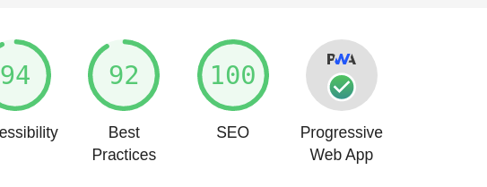
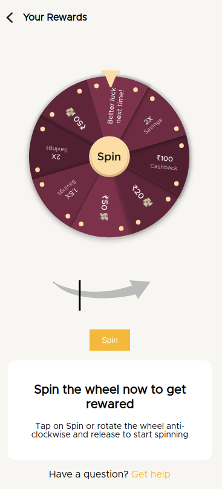
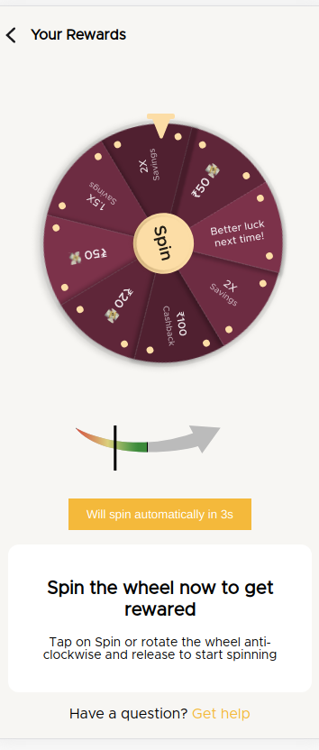

# Introduction

A wheel of fortune spinner game that can be installed as a PWA on your phones. URL for the game - [Link](https://fortune-game.netlify.app)

> PWA App made with React! All the results being stored in a google sheet - [URL](https://docs.google.com/spreadsheets/d/1f_kNiKPon6y7vmHG3j1BaebXnRjHLeszGASUpCjl01I/edit?usp=sharing)

# Details for Installation

> Make sure you have Node.js installed in your computer.

- Fork and Clone this repository
- Run `npm install` or `yarn` in the base directory.
- Run `npm start` or `yarn start` to run the app.
- Make sure to rename `.env.example` to `.env` and add in your credentials

# Screenshots

### Spreadsheet data

## PWA - Lighthouse Report

## Main Screen

## Rotation

